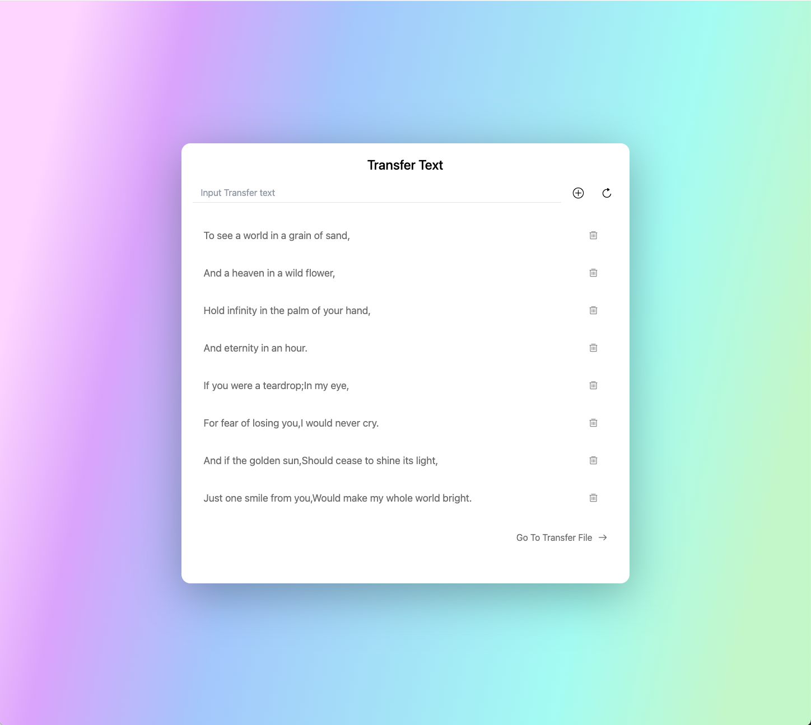
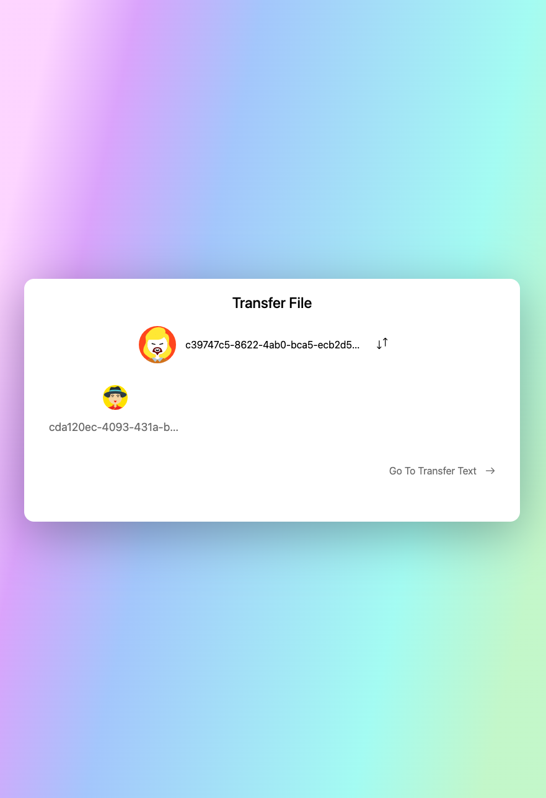
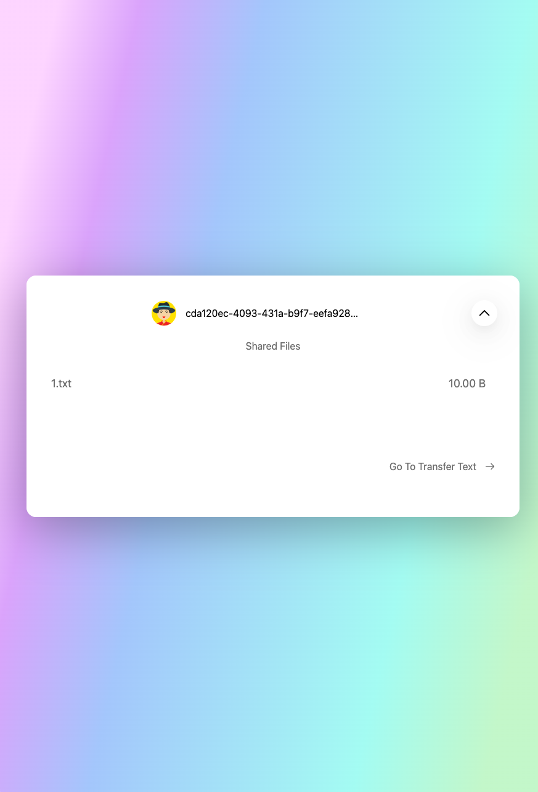

## LinkLAN
  
[中文](./README-zh.md)  
  
Do you ever find yourself in a situation where you urgently need to transfer text or files but can't access messaging apps like WeChat or QQ? Look no further! Try out this browser-based "File Transfer Assistant" that operates within your local network.

This software is built using web technologies and Node.js. You only need a computer with Node.js installed to host your own file transfer assistant within your local network. Moreover, there's no need to download any additional software; you can experience all the features directly in your browser.

> This software can run entirely within a network without internet access.
>
> Before using, make sure to test network connectivity between host and target machines using the ping command.


### How to Use
```bash
npm install -g link-lan

linklan
````
#### Command Line Arguments
| Argument | 	Optional Values | 	Meaning              |
|----------|------------------|-----------------------|
| -h	      | -	               | Get help information  |
| -f	      | -	               | Force rebuild website |
| -p	      | 80~65534         | Specify running port  |


### Quick Start

1. Clone the project:

   ```bash
   git clone https://github.com/lidppp/link-lan.git
   ```

2. Navigate to the project directory:

   ```bash
   cd link-lan
   ```

3. Install dependencies:

   ```bash
   npm install
   # Or using yarn (recommended)
   yarn install
   ```

4. Start the server:

   ```bash
   npm run start
   ```

   Once you see the following output, the server has started successfully:

   ```text
   sever run in http://192.168.50.178:3000
   socket.io run in ws://192.168.50.178:3000
   peer.js run in http://192.168.50.178:3001
   ```

### Page Display

#### Text Transfer

Click on a message to copy it.



#### File Transfer

Click on the avatar to view shared files. Click the `↓↑` button to upload files.



Click on a file row to download the file.



### Technology Stack

- [Express.js](https://expressjs.com/)
- [Vue.js](https://vuejs.org/)
- [peer.js(WebRTC)](https://peerjs.com/)
- [socket.io](https://socket.io/)
- [multiavatar](https://multiavatar.com/)

- [sqlite3](https://github.com/TryGhost/node-sqlite3)

